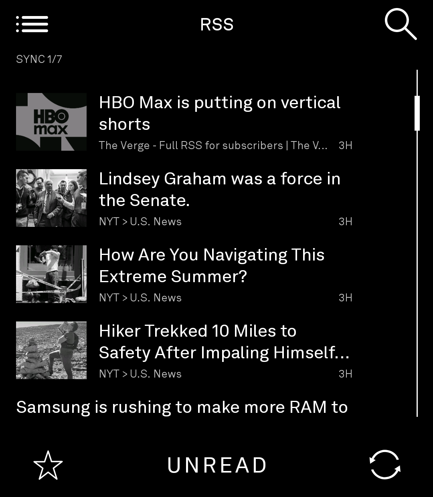

# LightRSS

A quiet RSS and Atom reader for the Light Phone III. Feeds, reading state, saved
articles, images and search all stay on the phone.

This is a fork of **[zachattack323/LightRSS](https://github.com/zachattack323/LightRSS)**
that adds two things: images in the list and the reader, and subscribing by QR code
instead of typing a URL on the phone keyboard. Work happens on the `images-and-qr`
branch.

Part of the [gi-os Light App collection](#the-gi-os-light-app-collection).

<p align="center">
  <br>
  <sub>On the phone. Feed thumbnails are what this fork adds.</sub>
</p>

The rest are from the 1080 x 1240 LightOS emulator.

<table>
  <tr>
    <td align="center">
      <br>
      <sub>Unread inbox</sub>
    </td>
    <td align="center">
      <br>
      <sub>Text-first reader</sub>
    </td>
  </tr>
  <tr>
    <td align="center">
      <br>
      <sub>Subscriptions</sub>
    </td>
    <td align="center">
      <br>
      <sub>Feed entry</sub>
    </td>
  </tr>
</table>

All screenshots show public feed content.

## What this fork adds

- **Images.** A thumbnail on each article row, and full-width pictures in the reader.
  The app downsamples them and renders them gray for the panel. It reads them from
  `enclosure`, `media:content`, `media:thumbnail`, `itunes:image` and inline ``
  markup, and drops 1 x 1 beacons, `data:` URIs and known tracking hosts. Downloads
  happen lazily, only for rows on screen, into an 8 MB memory cache and a 24 MB disk
  cache. A Settings switch turns the whole thing off.
- **QR subscribing.** Open **Subscriptions**, then **+**, then **Scan QR code**. The
  scanner accepts a bare URL, a `feed://` or `rss://` scheme, and a code that wraps an
  address inside other text.
- **A generator to match.** [gi-os.github.io/LightRSS](https://gi-os.github.io/LightRSS)
  turns any feed or site address into a code, in the browser.
- **Keyboard choice.** Paste an address, use the phone keyboard, or use the Light
  keyboard.
- **A reader that opens the real page.** **OPEN** fetches the linked article and renders
  body copy and images in Light typography. Reader mode uses no WebView, so no script,
  advertisement or tracking pixel loads there.
- **Sign-in that the reader reuses.** When a site answers with a bot check or a subscriber
  wall, **SIGN IN** opens that page in an in-app WebView. It keeps the cookies the page
  hands back, per host, and records the user agent that earned them, because one host
  rarely honors one without the other. Reader fetches for that host then send both. Feed
  refreshes never do. This WebView is the only one in the app and the only place a page's
  scripts run.

## What it inherited

- Parses RSS 2.0, Atom and RDF/RSS, including namespaced content and the common date
  formats.
- Accepts a feed URL or an ordinary site URL, and discovers the feed metadata.
- Ships with removable NASA, BBC World and Hacker News subscriptions.
- Refreshes with `ETag` and `Last-Modified` conditional requests.
- Stores subscriptions, articles, unread state, saved items and archive state in a local
  Room database.
- Supports unread and all views, per-feed timelines, local search, saved articles,
  mark-all-read, archive and unfollow.
- Keeps feed text readable offline after the first download.
- Parses XML defensively, with DTD processing and external entities turned off.

## Icon

A white **R** on black, matching the letter-on-black icons of the sibling Light tools. Plain
bitmap mipmaps, with no adaptive layer, so anything that reads the icon out of the package
gets a bitmap. To redraw it with another letter or face:

```bash
python3 scripts/generate_icon.py --letter R --font /path/to/PublicSans-Regular.ttf
```

Public Sans is the face the other tools use. It is not vendored here, so pass `--font` to
reproduce the committed art exactly. Without it the script falls back to a system sans.

## Built for LightOS

The interface uses the SDK rather than imitating it.

- `LightTheme` and the SDK typography and color tokens on every screen.
- `LightTopBar`, `LightBottomBar`, `LightBarButton` and `LightIcons`.
- `LightLazyScrollView` and `LightScrollView` with LightOS scrollbars.
- `LightTextInputEditor` and the Light Phone keyboard.
- The 27 x 31 Light grid through `gridUnitsAsDp`.
- One SDK screen per editor, confirmation, message and content view.
- The visible back button and the system back action behave the same way.

## Privacy

LightRSS adds no account, no advertising, no analytics and no server of its own. It
contacts the addresses you subscribe to, so those hosts see an ordinary HTTP request,
your IP address and the `LightRSS/1.1 (Light Phone III)` user agent. With images on, it
also requests pictures from whichever host serves them, only for articles on screen.

Unfollowing a feed removes its local articles. Settings can remove read, unsaved
articles. Uninstalling removes the database. [PRIVACY.md](PRIVACY.md) has the full
disclosure.

## Install

Signed APKs hang off every [release](https://github.com/gi-os/LightRSS/releases).

```sh
adb install -r LightRSS-<version>.apk
```

Or add `https://github.com/gi-os/LightRSS` to
[Obtainium](https://github.com/ImranR98/Obtainium) for updates.
[INSTALL.md](INSTALL.md) lists the signing fingerprint to verify against.

## Build

You need JDK 17, Android SDK Platform 36, the command-line tools, and a GitHub token
with package-read access for the SDK keyboard dependency.

```sh
export JAVA_HOME="<path-to-jdk-17>"
export ANDROID_HOME="<path-to-android-sdk>"
export GH_PACKAGES_USER="<github-username>"
export GH_PACKAGES_TOKEN="<token-with-read:packages>"

./gradlew :tool:testDebugUnitTest :tool:lintDebug :tool:assembleDebug
```

`gpr.user` and `gpr.key` in `local.properties` work as well. Never commit either one.
The debug APK lands in `tool/build/outputs/apk/debug/`.

To run in the emulator, set `serverPackage = "com.thelightphone.sdk.emulator"` in
`tool/lighttool.toml`, then follow the SDK
[system-app guide](docs/system_app/README.md). Set it back to `com.lightos` before a
device build.

## Release notes

- `com.lightrss.reader` is the tool ID. Treat it as permanent and confirm ownership
  before a first official submission.
- `lighttool.toml` requests `INTERNET` and `CAMERA`. The camera serves the scan screen
  and nothing else.
- Local debug and release APKs use the SDK public development keystore. They are not
  production artifacts.
- Community-tool distribution keeps changing. Check the current upstream SDK guidance
  before a release.

Read [CHANGELOG.md](CHANGELOG.md), [SECURITY.md](SECURITY.md) and
[THIRD_PARTY_NOTICES.md](THIRD_PARTY_NOTICES.md) before you publish anything.

## Origin and credits

- **[zachattack323](https://github.com/zachattack323)** wrote
  [LightRSS](https://github.com/zachattack323/LightRSS). The parser, the Room schema, the
  repository layer, the conditional refresh and the LightOS screens are all his work.
  This fork adds images, QR subscribing and the reader view on top of a reader that
  already worked. Thank you.
- **[lightphone/light-sdk](https://github.com/lightphone/light-sdk)** and
  **[lightphone/light-keyboard](https://github.com/lightphone/light-keyboard)** by The
  Light Phone provide the client library, the UI kit, the keyboard and the builder, all
  MIT.
- **[gi-os/LightPass](https://github.com/gi-os/LightPass)** supplied the camera code.
  The SDK scanner would not start reliably in a release build, so `RssScanner.kt` now
  owns a CameraX `LifecycleCameraController` and reads the camera permission with
  `Context.checkSelfPermission`, the same way LightPass does. LightOS still raises its
  own permission dialog, but it no longer gets a vote on whether the preview starts.
- **[gi-os/LightQR](https://github.com/gi-os/LightQR)** supplied the browser-side code
  generator that became `docs/index.html`.
- **[Obtainium](https://github.com/ImranR98/Obtainium)** by ImranR98 handles updates.
- [THIRD_PARTY_NOTICES.md](THIRD_PARTY_NOTICES.md) lists every runtime dependency and
  its license.

## The gi-os Light App collection

Twelve tools for the Light Phone III, all open source, all built in one run.

| Tool | What it does | Built on |
| --- | --- | --- |
| [LightPass](https://github.com/gi-os/LightPass) | Photograph a movie ticket, keep the stub | Plain Android |
| [LightQR](https://github.com/gi-os/LightQR) | QR scanner, plus a browser generator | Plain Android |
| **LightRSS** (this repo) | RSS and Atom reader with images and QR subscribe | light-sdk, fork of [zachattack323/LightRSS](https://github.com/zachattack323/LightRSS) |
| [LightNYCSubway](https://github.com/gi-os/LightNYCSubway) | Live MTA subway arrivals | light-sdk fork |
| [chat](https://github.com/gi-os/chat) | iMessage over a self-hosted BlueBubbles server | Fork of [craigeley/chat](https://github.com/craigeley/chat) |
| [LightFog](https://github.com/gi-os/LightFog) | Fog of World companion, GPS recorder and fog map | Fork of [garado/light-topographic](https://github.com/garado/light-topographic) |
| [LightNonogram](https://github.com/gi-os/LightNonogram) | Picross, plus a generator that only ships solvable puzzles | Kotlin generator, light-sdk tool |
| [LightSolitaire](https://github.com/gi-os/LightSolitaire) | Klondike, draw one, unlimited redeals | light-sdk |
| [LightFastread](https://github.com/gi-os/LightFastread) | RSVP speed reader for EPUB and MOBI | Fork of [fluffyspace/FastRead](https://github.com/fluffyspace/FastRead) |
| [LightTip](https://github.com/gi-os/LightTip) | Tip calculator, plus a receipt splitter that reads the line items | Plain Android |
| [LightNoise](https://github.com/gi-os/LightNoise) | Twelve synthesized sounds, a two-layer mixer and a sleep timer | Plain Android |
| [LightPods](https://github.com/gi-os/LightPods) | AirPods battery, in-ear and lid status | Plain Android, ports [LibrePods](https://github.com/kavishdevar/librepods) |

The Light Phone does not sponsor or endorse any of these. Licences vary per repo.

## Contributing and license

Read [CONTRIBUTING.md](CONTRIBUTING.md) before you open an issue or a pull request.
Send security reports through the private process in [SECURITY.md](SECURITY.md), not to a
public issue.

MIT, the same as upstream. See [LICENSE](LICENSE).
