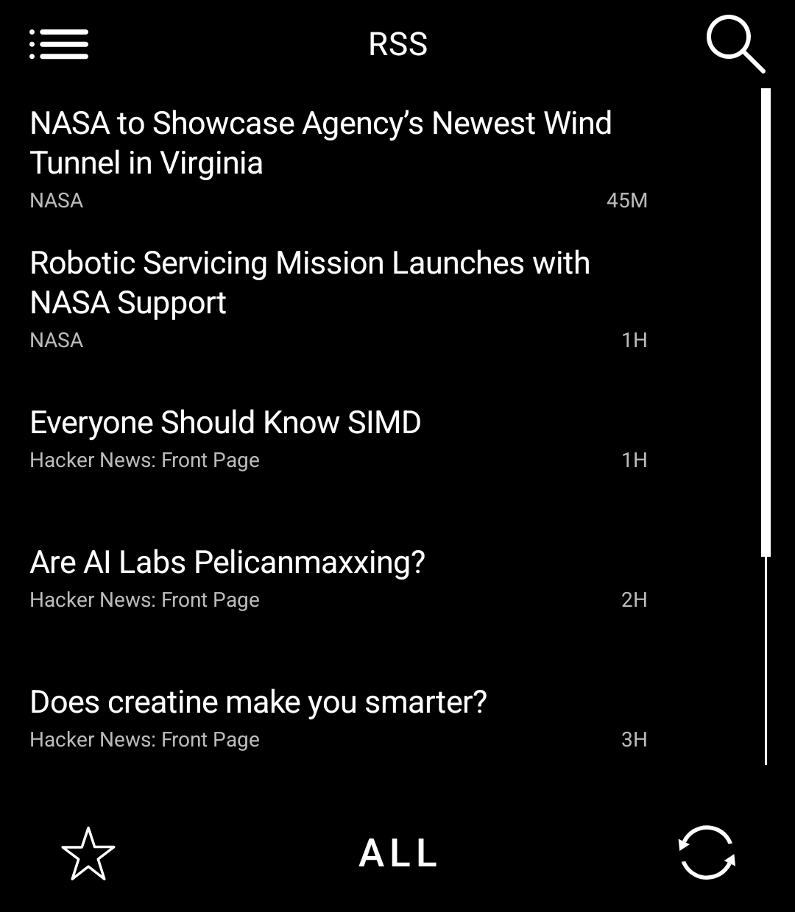
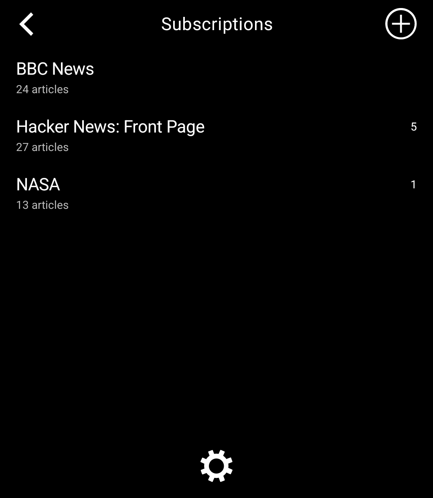
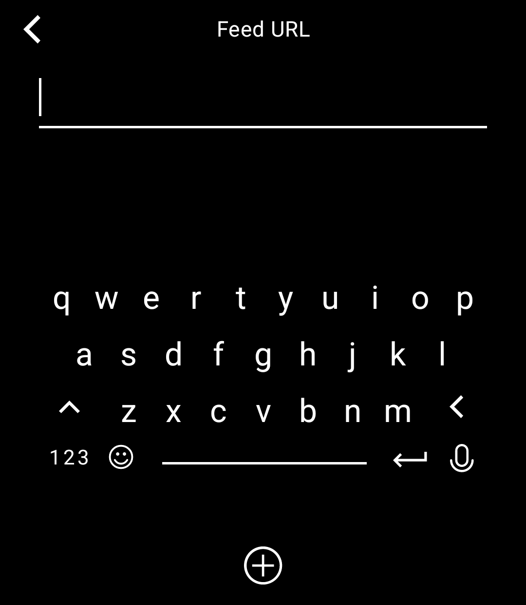

# Light RSS

**A quiet, full-featured RSS and Atom reader for the Light Phone III.**

Light RSS is an unofficial community tool built inside the official [Light SDK](https://github.com/lightphone/light-sdk). It keeps feeds, reading state, saved articles, images, and search on the phone while following LightOS navigation and visual conventions.

This fork adds two things to [zachattack323/LightRSS](https://github.com/zachattack323/LightRSS): **feed images** in the list and reader, and **adding subscriptions by scanning a QR code** instead of typing a URL.

<table>
  <tr>
    <td align="center">
      <br>
      <sub>Compact unread inbox</sub>
    </td>
    <td align="center">
      <br>
      <sub>Text-first reader</sub>
    </td>
  </tr>
  <tr>
    <td align="center">
      <br>
      <sub>Subscriptions</sub>
    </td>
    <td align="center">
      <br>
      <sub>Native feed entry</sub>
    </td>
  </tr>
</table>

Screenshots are from the 1080 × 1240 LightOS emulator and show public feed content.

## Features

- Parses RSS 2.0, Atom, and RDF/RSS feeds, including namespaced content and common date formats.
- Accepts a direct feed URL or a normal website URL and discovers RSS/Atom metadata.
- Starts with removable NASA, BBC World, and Hacker News subscriptions.
- Refreshes efficiently with `ETag` and `Last-Modified` conditional requests.
- Stores subscriptions, articles, unread state, saved items, and archive state in a local Room database.
- Supports unread/all views, per-feed timelines, local search, saved articles, mark-all-read, archive, and unfollow.
- Keeps feed-provided text available offline after it has been downloaded.
- Opens the linked page in a built-in reader view: body copy and images only, extracted without a browser.
- Recognises bot checks and subscriber walls, and can clear them in an in-app sign-in view whose cookies the reader then reuses.
- Uses defensive XML parsing with DTD processing and external entities disabled.
- Includes light/dark appearance switching and local cleanup controls.
- Shows feed images: a thumbnail per article row and full-width images in the reader, downsampled and rendered greyscale for the Light Phone display.
- Pulls images from `enclosure`, `media:content`, `media:thumbnail`, `itunes:image`, and inline `` markup, dropping 1 × 1 beacons, `data:` URIs, and known tracking hosts.
- Downloads images lazily, only for rows and articles on screen, into an 8 MB memory cache and a 24 MB disk cache.
- Adds subscriptions by scanning a QR code with the SDK scanner, accepting bare URLs, `feed://` and `rss://` schemes, and codes that wrap an address in text.
- Pairs with a browser-side [QR code generator](https://gi-os.github.io/LightRSS) for turning a feed address into a scannable code.
- Takes feed addresses by paste, by the phone's own keyboard, or by the Light keyboard, whichever is least painful.
- Keeps a Settings switch for images: turn them off for a text-only reader, or clear the cache and keep them on.

**OPEN** on any article fetches the linked page and renders a reader-mode version of it in Light
typography. Reader mode uses no WebView; the only WebView in the app is the SIGN IN screen, which
exists so a bot check or login can be cleared and reused. It turns feed-provided HTML into a focused reading view of text and, when images are enabled, the pictures the publisher placed in the article. Scripts, advertisements, and tracking pixels are never loaded, and images can be switched off entirely in Settings.

## Built for LightOS

The UI is deliberately compact and uses the SDK rather than imitating it:

- `LightTheme` and the SDK typography/color tokens on every screen.
- `LightTopBar`, `LightBottomBar`, `LightBarButton`, and `LightIcons` for navigation and actions.
- `LightLazyScrollView` and `LightScrollView` with LightOS scrollbars.
- `LightTextInputEditor` and the Light Phone keyboard for feed entry and search.
- `LightQrCodeScanner` from the SDK for the scan-to-subscribe screen, including its camera permission flow.
- The 27 × 31 Light grid through `gridUnitsAsDp`.
- One SDK screen per editor, confirmation, message, and content view.
- Identical one-layer behavior for the visible back button and the phone's system back action.

## Privacy

Light RSS does not add an account, advertising, its own analytics integration, or a Light RSS-operated server. The app contacts the feed or website addresses you subscribe to, so those hosts receive an ordinary HTTP request, your IP address, and the `LightRSS/1.1 (Light Phone III)` user agent. On first launch it adds and refreshes the three starter feeds listed above.

With images enabled, the app also requests images from whichever host serves them, but only for articles that are on screen. All subscriptions, article text, and downloaded images are stored locally. Unfollowing a feed removes its local articles; Settings can remove read, unsaved articles; uninstalling the app removes its database. See [PRIVACY.md](PRIVACY.md) for the complete disclosure.

## Feed QR codes

[**gi-os.github.io/LightRSS**](https://gi-os.github.io/LightRSS) turns any feed or website address
into a QR code. Scan it with **Subscriptions → + → Scan QR code** instead of typing a URL on the
Light Phone keyboard. The page is static, runs its encoding in your browser, and loads nothing from
a third party.

## Install

Prebuilt, signed APKs are attached to every [release](https://github.com/gi-os/LightRSS/releases).
Install once with `adb install -r LightRSS-<version>.apk`, or add
`https://github.com/gi-os/LightRSS` to [Obtainium](https://github.com/ImranR98/Obtainium) to get
updates automatically. Full instructions, including the signing fingerprint to verify, are in
[INSTALL.md](INSTALL.md).

## Build

### Requirements

- JDK 17
- Android SDK Platform 36 and Android SDK command-line tools
- A GitHub account and package-read credential for the SDK's Light Keyboard dependency

The dependency credential is read from environment variables:

```bash
export JAVA_HOME="<path-to-jdk-17>"
export ANDROID_HOME="<path-to-android-sdk>"
export GH_PACKAGES_USER="<github-username>"
export GH_PACKAGES_TOKEN="<token-with-package-read-access>"
```

Alternatively, put `gpr.user` and `gpr.key` in the ignored `local.properties` file. Never commit either credential.

Build and verify the app from the repository root:

```bash
./gradlew :tool:testDebugUnitTest :tool:lintDebug :tool:assembleDebug
```

The debug APK is written to `tool/build/outputs/apk/debug/tool-debug.apk`.

The trusted GitHub Actions build uses repository secrets with the same `GH_PACKAGES_USER` and `GH_PACKAGES_TOKEN` names. Configure them before enabling builds on `main`; they are never exposed to pull-request code.

## Run in the LightOS emulator

The recommended emulator is an API 34 AOSP image with a 1080 × 1240, 3.92-inch display and no Google Play services. Follow the SDK's [system-app emulator guide](docs/system_app/README.md) for the one-time setup.

For emulator builds only, temporarily change this line in `tool/lighttool.toml`:

```toml
serverPackage = "com.thelightphone.sdk.emulator"
```

Then build, install, and open the apps:

```bash
./gradlew :sdk:emulator:assembleDebug :tool:assembleDebug
adb install --no-incremental -r sdk/emulator/build/outputs/apk/debug/emulator-debug.apk
adb install --no-incremental -r tool/build/outputs/apk/debug/tool-debug.apk
adb shell am start -n com.thelightphone.sdk.emulator/.MainActivity
```

Restore `serverPackage = "com.lightos"` before a device or release build.

## Release notes

- The publishable source defaults to the real LightOS server package, `com.lightos`.
- `com.lightrss.reader` is the tool ID. Treat it as permanent and confirm ownership before the first official submission.
- Light RSS requests `android.permission.INTERNET` and `android.permission.CAMERA` in `lighttool.toml`. The camera is used only by the scan-to-subscribe screen. The merged APK also inherits Android permissions and components from the current Light SDK dependency graph; the exact set and how it is used are documented in [PRIVACY.md](PRIVACY.md#permissions).
- Local debug and release APKs use the SDK's public development keystore. They are not production-signed artifacts.
- The bundled Light builder produces an unsigned APK with local signing removed; official distribution/signing follows the process provided by Light.
- Community-tool distribution is evolving. Check the current upstream SDK guidance before submitting a release.

See [CHANGELOG.md](CHANGELOG.md), [SECURITY.md](SECURITY.md), and [THIRD_PARTY_NOTICES.md](THIRD_PARTY_NOTICES.md) before publishing.

## Project map

| Path | Purpose |
|---|---|
| `tool/lighttool.toml` | Tool identity, version, LightOS target, and permission declaration |
| `tool/src/main/kotlin/com/lightrss/reader/RssDatabase.kt` | Room entities, queries, and persistence rules |
| `tool/src/main/kotlin/com/lightrss/reader/RssParser.kt` | RSS/Atom parsing, discovery, text cleanup, dates, and stable IDs |
| `tool/src/main/kotlin/com/lightrss/reader/RssRepository.kt` | Networking, conditional refresh, subscriptions, sync, and article actions |
| `tool/src/main/kotlin/com/lightrss/reader/RssViewModels.kt` | Screen state and background work |
| `tool/src/main/kotlin/com/lightrss/reader/RssScreens.kt` | LightOS-native screens and navigation |
| `tool/src/main/kotlin/com/lightrss/reader/RssUi.kt` | Shared feed/article rows, empty states, and formatting |
| `tool/src/test/kotlin/com/lightrss/reader/RssParserTest.kt` | Parser, discovery, date, and URL tests |

## Contributing and license

Read [CONTRIBUTING.md](CONTRIBUTING.md) before opening an issue or pull request. Security reports belong in the private process described in [SECURITY.md](SECURITY.md), not in a public issue.

Light RSS and the bundled Light SDK are available under the [MIT License](LICENSE). Light Phone, LightOS, and Light Phone III are names of The Light Phone; this project is not affiliated with or endorsed by The Light Phone.
